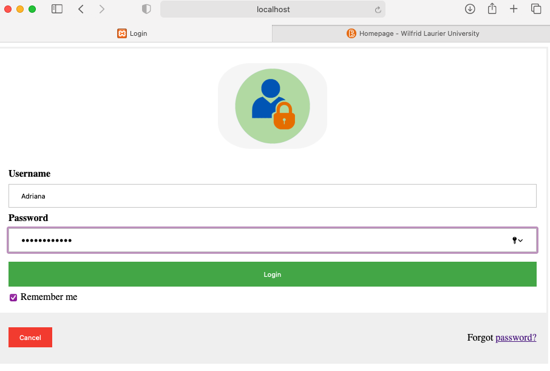
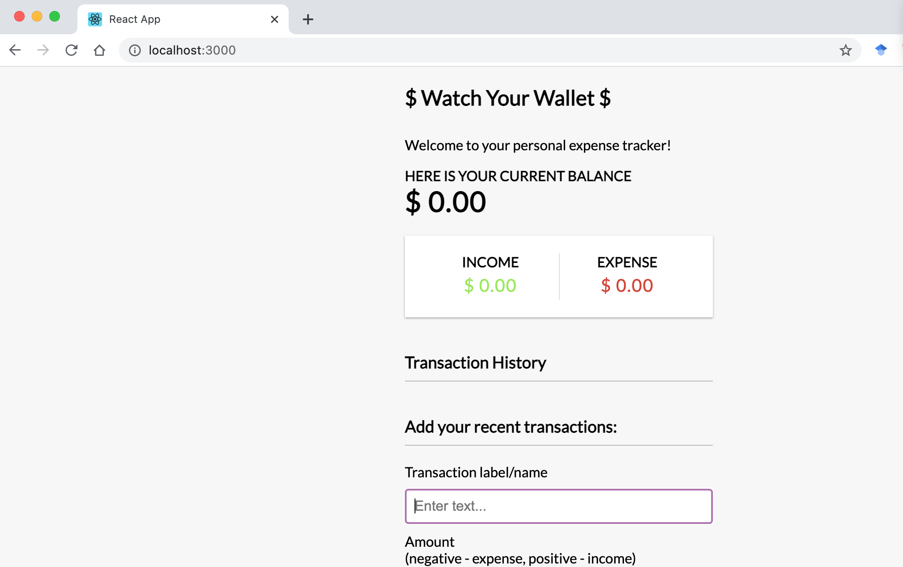
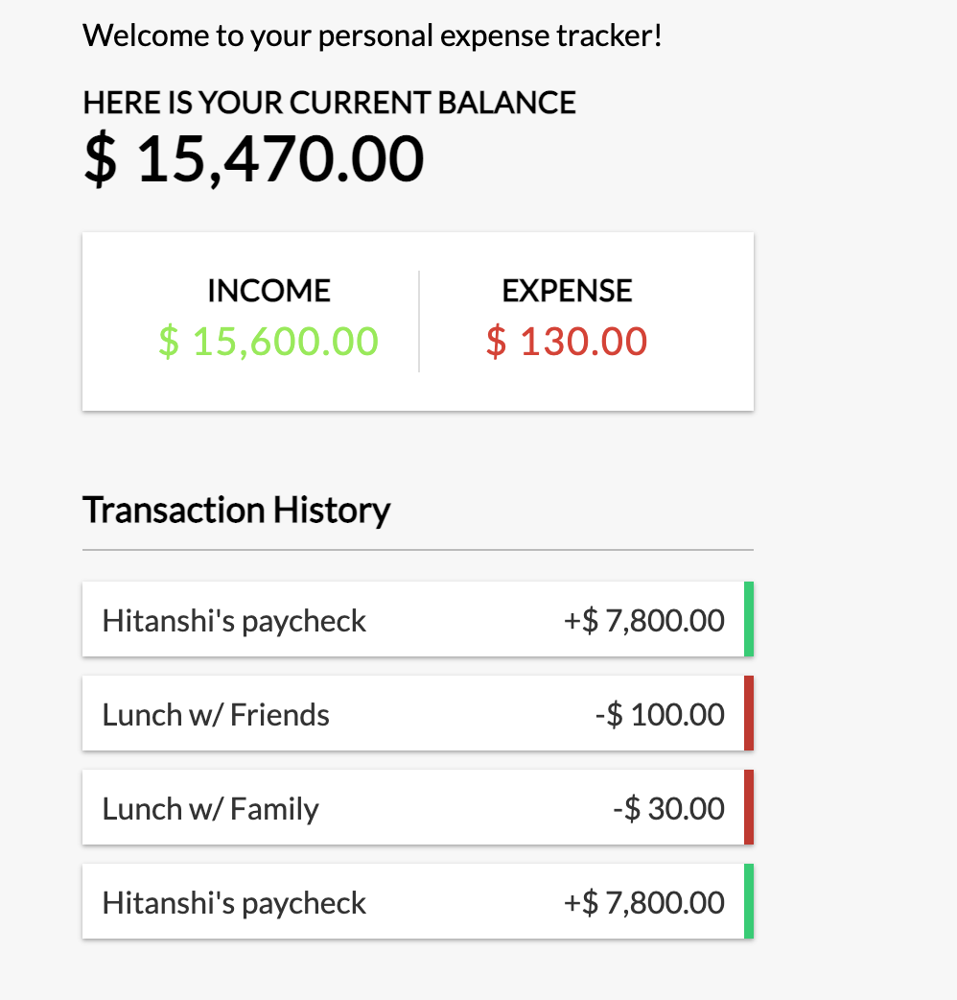
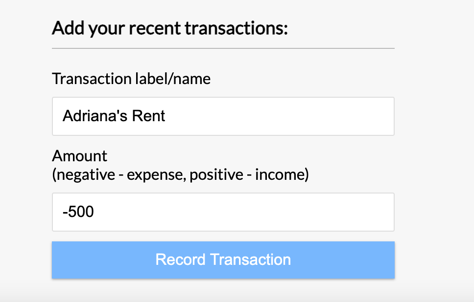

# Final Project Report

Author: Hitanshi Shroff

Date: 12/04/2021

### Refer to the presentation pdf for a better explanation of our project. 

{width=600px}

{width=600px}

{width=600px}
 

{width=600px}
{width=600px}
 
 {width=600px}

 {width=600px}

 {width=600px}

 {width=600px}

 {width=600px}

 {width=600px}

### Thank you! 
